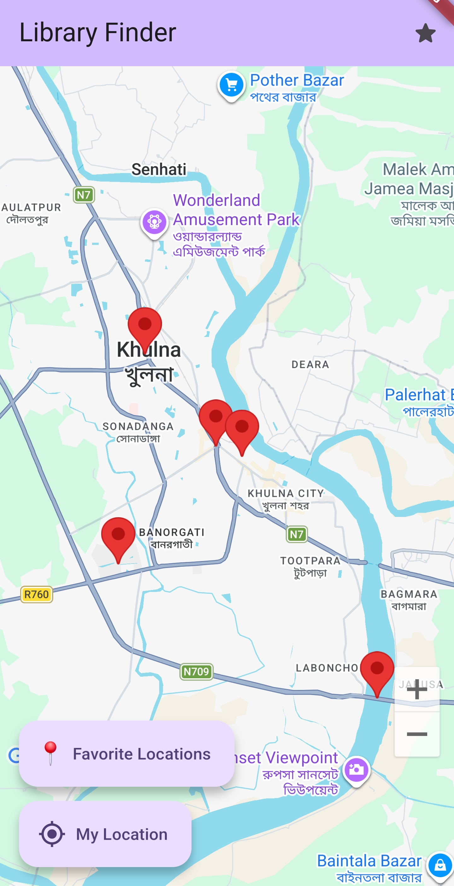
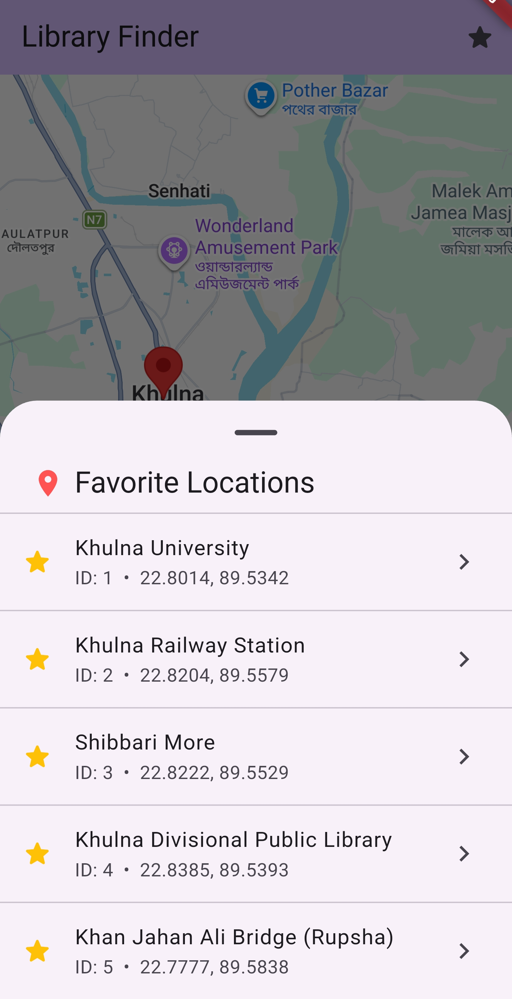
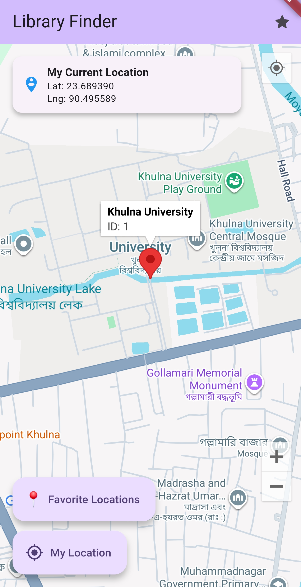
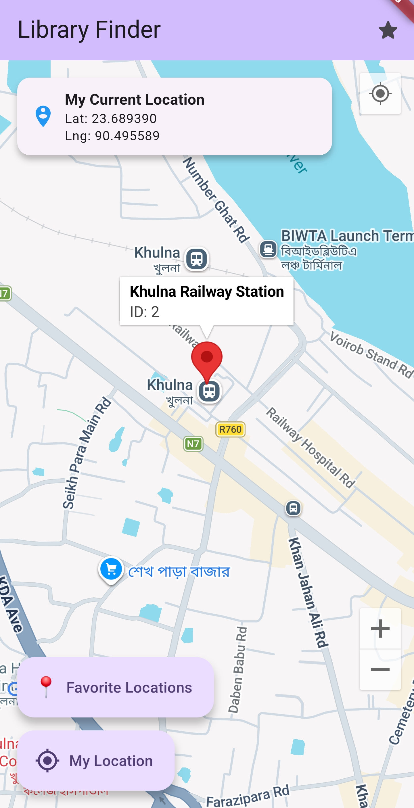
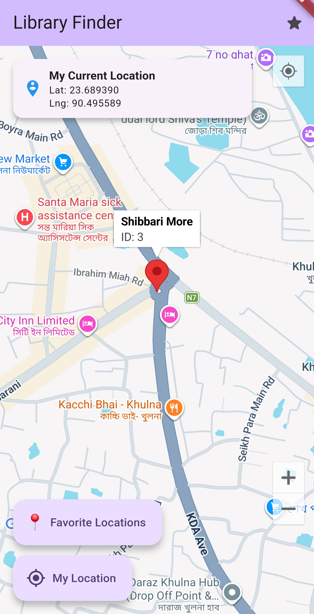
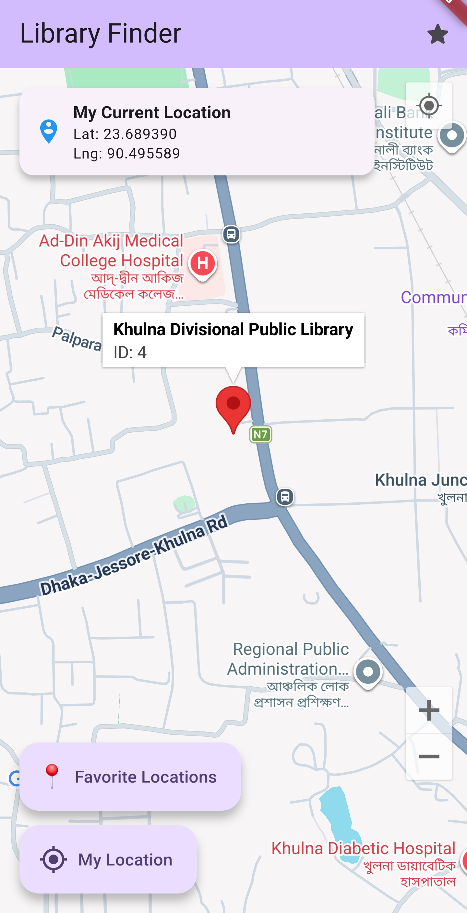
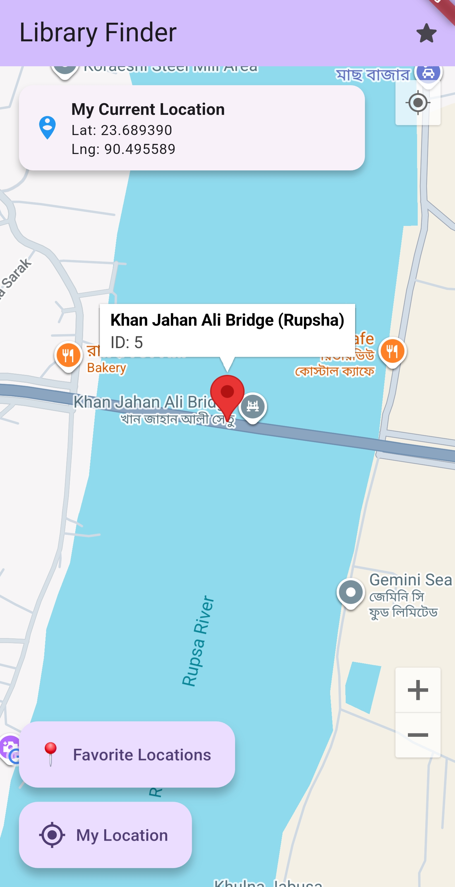

# Library Finder – Google Maps & Location (Flutter Assignment)

A Flutter app that shows a Google Map with the user's **current location** (from the device's
location service via `geolocator`) and a set of **favorite locations** in Khulna, Bangladesh.

## Features

| Requirement | How it's done |
|---|---|
| Google Map on start | `GoogleMap` widget on the home page, centered on Khulna |
| Zoom controls | `zoomControlsEnabled: true` (+ pinch zoom) |
| Current location button | **My Location** button (geolocator) + Google's built-in location button once permission is granted |
| Current location (not hard-coded) | `Geolocator.getCurrentPosition()` → lat/lng → `animateCamera` → blue "You are here" marker + card showing latitude/longitude |
| Permission handling | Checks location service, requests permission, handles *denied* and *denied forever* (snackbar with **Settings / Turn on** action) |
| Favorite location model | `FavoriteLocation { id, name, latitude, longitude }` |
| ≥ 3 favorite markers | 5 red markers (see table below) |
| Marker tap | Bottom sheet showing ID, Name, Latitude, Longitude |
| 📍 Favorite Locations list | Bottom sheet list with ⭐ items; tapping one moves the camera there |

### Favorite locations

| ID | Name | Latitude | Longitude |
|---|---|---|---|
| 1 | Khulna University | 22.8014 | 89.5342 |
| 2 | Khulna Railway Station | 22.8204 | 89.5579 |
| 3 | Shibbari More | 22.8222 | 89.5529 |
| 4 | Khulna Divisional Public Library | 22.8385 | 89.5393 |
| 5 | Khan Jahan Ali Bridge (Rupsha) | 22.7777 | 89.5838 |

## Project structure

```
lib/
├── main.dart
├── app.dart
├── core/
│   ├── models/favorite_location.dart        # FavoriteLocation model
│   ├── data/favorite_locations_data.dart    # predefined favorites
│   └── services/location_service.dart       # geolocator + permission handling
└── features/home/
    ├── pages/home_page.dart                 # map, markers, buttons
    └── widgets/
        ├── favorite_list_sheet.dart         # 📍 Favorite Locations list
        └── location_details_sheet.dart      # marker details
```

## Run

```bash
flutter pub get
flutter run
```

On an Android emulator, set a location in **Extended Controls → Location** before pressing **My Location**.

## Screenshots

| Google Map + favorite markers | Favorite locations list |
|---|---|
|  |  |

### Moving to a favorite from the list (current lat/lng card shown at top)

| Khulna University | Khulna Railway Station | Shibbari More |
|---|---|---|
|  |  |  |

| Divisional Public Library | Khan Jahan Ali Bridge |
|---|---|
|  |  |
